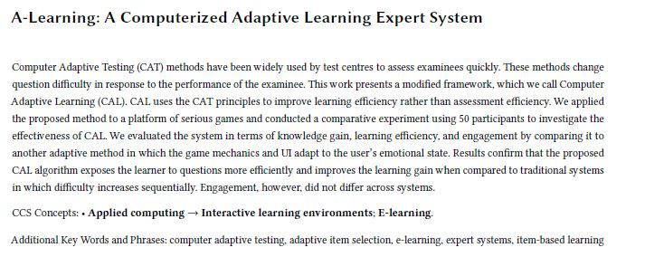

# A-Learning
Hello :D \
This repository showcases my project which was part of my Bachelor's research on Computer Adaptive Learning. Here's the abstract from my Thesis: \

In this repository you'll find 3 main folders:
* **MergeBuild:** Contains EduGa-Me.exe which is the complete Unity Build
* **FinalCode:** the source code for the Unity Project
* **GameDemos:** Demos for the different games and features of the project

## MergeBuild\EduGa-Me.exe
The EduGa-Me.exe file in the MergeBuild folder is an application made in Unity which can be split into two parts: the Editor and the 3 Games. 

### The Editor
Allows the educator to create a new MCQ game with their own pool of questions, however there's a trick. The CAL system is built to adapt the difficulty of the questions selected for a user to their ongoing performance. Simply put, the difficulty increases when the user answers questions correctly and decreases when they answer questions wrong. The main purpose of this feature is to target questions that challenge the learner. In order for this to be done, the educator has to first perform an "empirical calibration" of the questions by giving the paper-based questions to around 50 students and entering the students' answers in the Editor. The educator can then publish their fully adaptive game.

### The 3 Games
From the learner's side, the application consists of 3 games that play back to back. The pdf file **Instructions CAT** was used in the experiment to explain the gameplay. However, one game called "the LockedDoors game" was ommited from the experiment, however the gameplay can be understood from the demo. Note that we created the care 

### The Emotional Adaptivity
In the experiment, we aimed to compare two versions of the application; one with the CAL adaptivity feature and one which adapts the UI and game mechanics to the user's emotions. The user expresses their emotions through a valence-arousal scale and a set of emojis. This can be understood from the pdf file **Instructions UI** as well as the demo.

## FinalCode
This is the source code for the entire Unity project, in the Assets/Scripts folder you'll find 5 main scripts: **CATCalibEngine.cs** and **CATSelectEngine.cs** which were used to create the CAL adaptivity feature, and **CarScript.cs**, **LockedDoorsMaster.cs** and **PipeMaster.cs** which control the 3 games.
